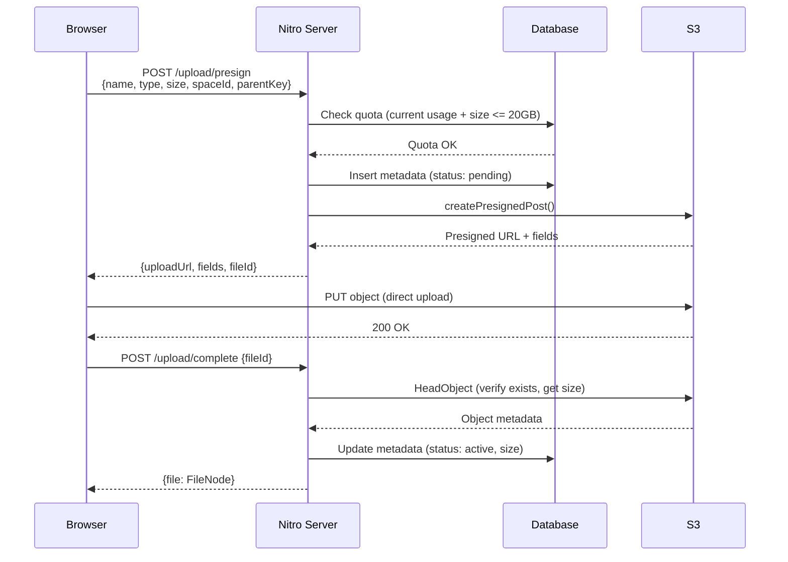
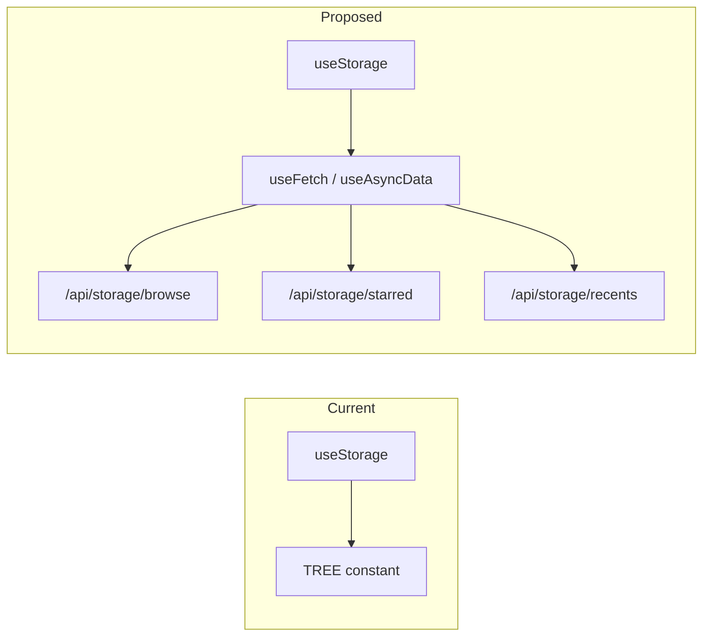
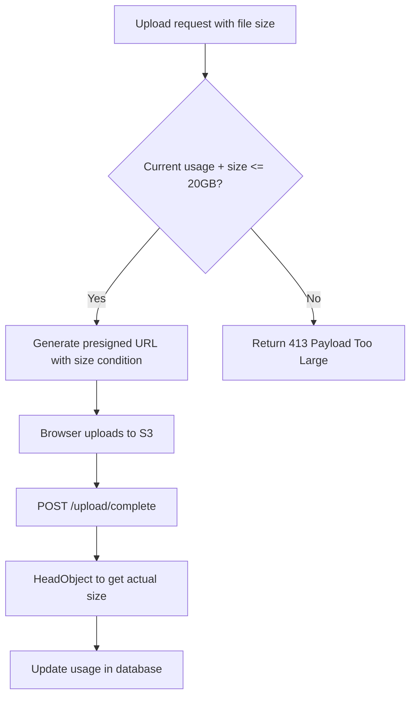
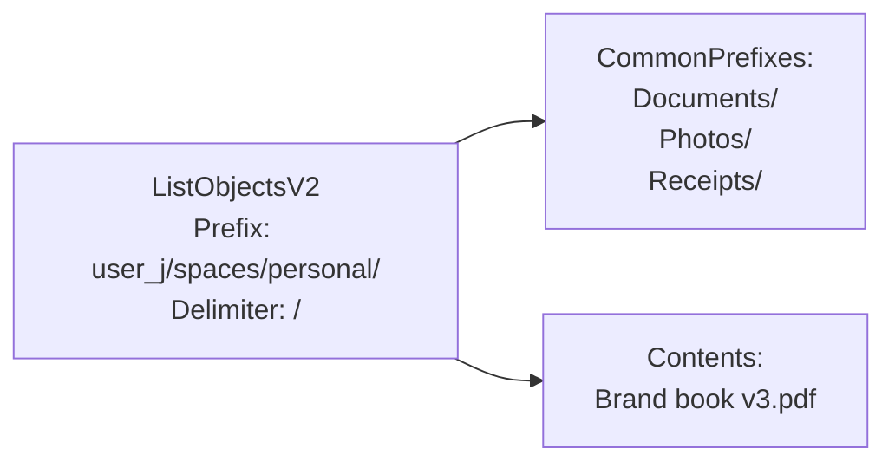
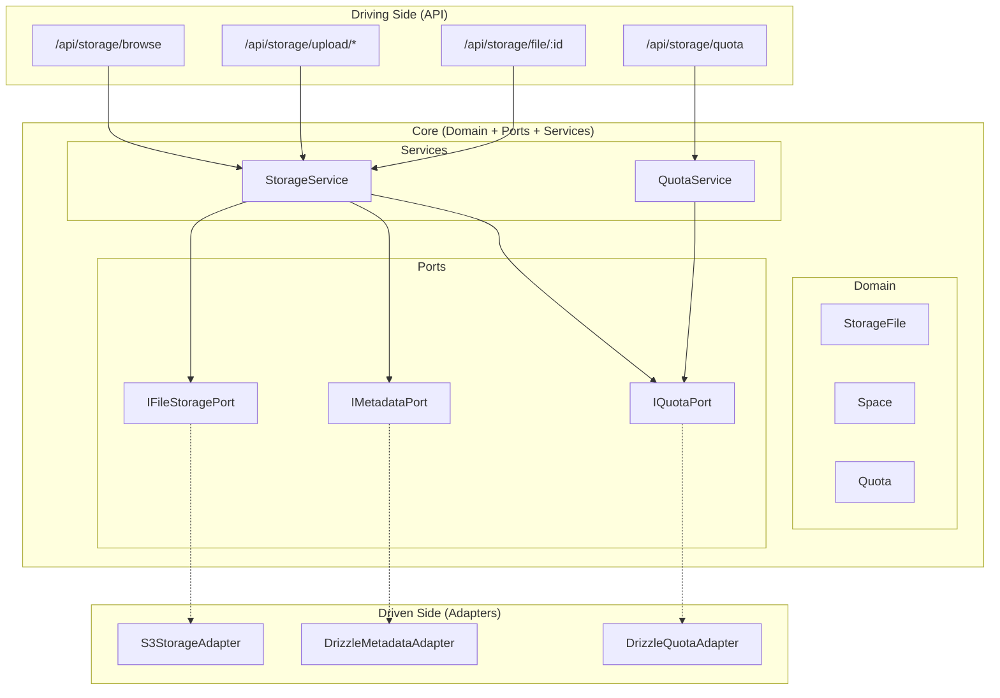
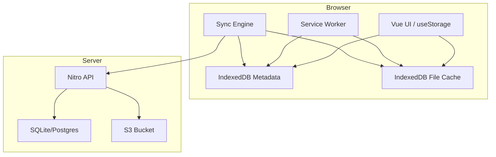
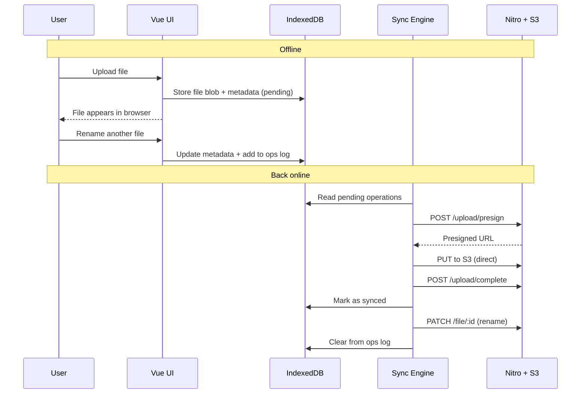
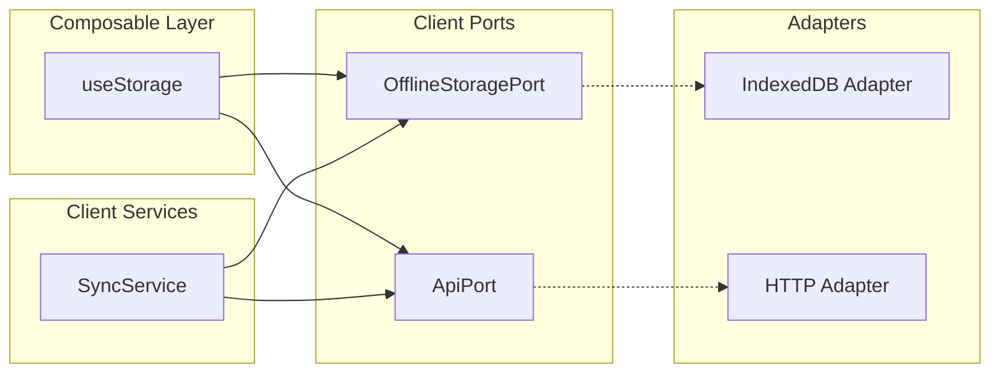

# S3 Integration Architecture

## Introduction

This document explores using Amazon S3 as the primary storage backend for the
storage app, a DIY Dropbox replacement built with Nuxt 4 and Nuxt UI v4. The app
currently runs entirely on the client side with a hardcoded tree of `FileNode`
objects in `app/data/tree.ts`. There is no `server/` directory, no database, and
no file upload capability.

The proposal is straightforward: a single S3 bucket holds all user files,
partitioned by user ID under a common prefix. Each user account has a 20GB
quota. S3 serves as both file storage and, at least initially, the source of
truth for the file hierarchy.

This document examines the architectural implications of that decision,
identifies the gaps between what S3 provides natively and what the app needs,
and proposes a hexagonal architecture that keeps the domain clean of AWS
specifics. This is an exploration, not an implementation plan.

## S3 Path Strategy

### Key Structure

Every object in the bucket lives under a user-scoped prefix. The key format
follows a simple convention that maps directly to the folder structure users see
in the UI.

```
{userId}/spaces/{spaceId}/{path}/{filename.ext}
```

A concrete example for the current hardcoded tree would look like this:

```
user_j/spaces/personal/Documents/Q4 Plan.docx
user_j/spaces/personal/Documents/meeting-notes.md
user_j/spaces/personal/Photos/IMG_4521.heic
user_j/spaces/family/Family Photos 2025/beach-day.jpg
user_j/spaces/family/recipes/pasta-amatriciana.docx
user_j/spaces/design/home-page/home-v3.fig
user_j/spaces/code/snippets/image-utils.ts
```

The `spaces/` segment is important. Spaces are the top-level organisational
concept in the app (Personal, Family, Design, Code Archive), and encoding them
into the path means a single `ListObjectsV2` call with the right prefix can
return everything within a space.

### How This Maps to FileNode

The current `FileNode` interface uses an `id` field for tree navigation. In an
S3-backed world, the natural identifier becomes the S3 key itself, or a
deterministic hash of it. The `id` field would transition from a short
hand-picked string like `f-q4` to something derived from the object's key, such
as the key's SHA-256 or a URL-safe Base64 encoding.

The `type` field (`folder`, `doc`, `pdf`, etc.) can be inferred from the file
extension and MIME type at upload time, rather than being stored explicitly. The
`ext` field comes from the key's suffix. The `size` and `modified` fields come
from S3 object metadata (Content-Length and Last-Modified).

### Reserved Prefixes

Certain prefixes within each user's namespace would be reserved for system use:

```
{userId}/.storage/trash/...
{userId}/.storage/meta/...
{userId}/.storage/thumbnails/...
```

The `.storage` prefix is invisible to the file browser and holds internal state.
This keeps user files cleanly separated from system artifacts.

## The Metadata Problem

S3 objects carry some metadata natively: Content-Type, Content-Length,
Last-Modified, ETag. You can also attach up to 2KB of user-defined metadata as
key-value pairs on each object. The current `FileNode` interface, however,
includes fields that do not map cleanly to S3.

The problematic fields are `starred`, `members` (sharing), `owner`, `editable`,
`color`, and `tags`. These are application-level concepts that S3 was never
designed to store. There are several approaches to handling this, each with real
tradeoffs.

### Option 1 -- S3 Object Metadata

S3 lets you store custom metadata headers on each object (the `x-amz-meta-*`
headers). You could encode `starred: true` and `owner: j` as metadata on the
object itself.

The appeal is simplicity: no separate data store, and the metadata travels with
the object. But the 2KB limit is a hard wall. A `members` array with more than a
handful of user IDs would start pushing against it. Worse, updating metadata
requires a full `CopyObject` operation (copy the object to itself with new
metadata), which is expensive for large files and creates a race condition
window. Querying across objects by metadata (e.g., "find all starred files")
requires listing every object and checking each one individually.

This option works only for a very small set of immutable properties. It is not
viable as the primary metadata store.

### Option 2 -- Sidecar `.meta.json` Files

For every file `Documents/Q4 Plan.docx`, store a companion object at
`{userId}/.storage/meta/spaces/personal/Documents/Q4 Plan.docx.json` containing
the metadata as JSON.

```json
{
  "starred": true,
  "members": ["j", "a", "m"],
  "owner": "j",
  "editable": true,
  "tags": ["work", "planning"]
}
```

This removes the 2KB limit and keeps everything in S3. But it doubles the number
of objects in the bucket, doubles the PUT/GET request costs, and creates a
consistency problem: every file operation (upload, rename, move, delete) must
also update the sidecar, and there is no transaction spanning two S3 PUTs. A
failed rename could leave an orphaned metadata file or a file without metadata.

Listing operations become especially painful. To build the file browser view,
you would need to list the actual files and then fetch metadata for each one,
turning a single `ListObjectsV2` into N+1 requests.

This approach is viable for an MVP if the app only needs per-file metadata
access (e.g., opening a detail panel), but it breaks down for views that query
across files (starred, shared, recents).

### Option 3 -- Lightweight Database

A relational database (SQLite for single-server, PostgreSQL for production)
stores all file metadata. S3 stores only the raw bytes.

The database table might look like:

```sql
CREATE TABLE file_metadata (
    id          TEXT PRIMARY KEY,
    user_id     TEXT NOT NULL,
    s3_key      TEXT NOT NULL UNIQUE,
    name        TEXT NOT NULL,
    type        TEXT NOT NULL,
    extension   TEXT,
    size_bytes  BIGINT,
    parent_key  TEXT,
    space_id    TEXT NOT NULL,
    starred     BOOLEAN DEFAULT FALSE,
    owner_id    TEXT NOT NULL,
    editable    BOOLEAN DEFAULT FALSE,
    color       TEXT,
    deleted_at  TIMESTAMPTZ,
    created_at  TIMESTAMPTZ DEFAULT NOW(),
    updated_at  TIMESTAMPTZ DEFAULT NOW()
);

CREATE TABLE file_members (
    file_id  TEXT REFERENCES file_metadata(id),
    user_id  TEXT NOT NULL,
    role     TEXT DEFAULT 'viewer',
    PRIMARY KEY (file_id, user_id)
);

CREATE TABLE file_tags (
    file_id  TEXT REFERENCES file_metadata(id),
    tag_id   TEXT NOT NULL,
    PRIMARY KEY (file_id, tag_id)
);
```

This is the strongest option. Queries like "all starred files for user X" become
a single indexed SELECT. Rename, move, and delete operations update metadata
atomically. Sharing and permissions get proper relational modelling.

The cost is added infrastructure. You need a database server (or embedded
SQLite), migrations, and a consistency mechanism to keep the database in sync
with S3. If an S3 upload succeeds but the database INSERT fails, you have an
orphaned object. This can be mitigated with a two-phase approach: write metadata
first with a `pending` status, upload to S3, then mark as `active`.

### Option 4 -- DynamoDB

Similar to Option 3 but using DynamoDB instead of a relational database. The
partition key would be the user ID and the sort key would be the S3 key, giving
you efficient per-user queries.

DynamoDB is a natural companion to S3 in the AWS ecosystem, and its on-demand
pricing means zero cost when idle. But it introduces DynamoDB's query model
limitations: no JOINs, secondary indexes required for any access pattern beyond
the primary key, and 400KB item size limit. For a small deployment, the
operational overhead of managing DynamoDB indexes and capacity modes is not
justified when SQLite or Postgres would do the job with simpler tooling.

### Recommendation

Option 3 (lightweight database) is the right choice. SQLite works for a
single-server deployment and can be upgraded to PostgreSQL later. The sibling
projects already use Drizzle ORM with PostgreSQL, so the tooling and patterns
are established. S3 object metadata should still carry Content-Type and
Content-Disposition for direct download, but all application metadata belongs in
the database.

## API Layer Design

### Server Route Map

The Nitro server layer needs routes for browsing, uploading, downloading and
managing files. These routes live under `server/api/storage/` and follow the
conventions established in the sibling boards project.

```
GET    /api/storage/spaces                    List user's spaces
POST   /api/storage/spaces                    Create a space
GET    /api/storage/browse?prefix=...         List files in a prefix
GET    /api/storage/file/:id                  Get file metadata
DELETE /api/storage/file/:id                  Soft-delete (trash)
PATCH  /api/storage/file/:id                  Update metadata
POST   /api/storage/file/:id/star             Toggle star
POST   /api/storage/file/:id/move             Move/rename
POST   /api/storage/file/:id/restore          Restore from trash

POST   /api/storage/upload/presign            Get presigned upload URL
POST   /api/storage/upload/complete           Confirm upload, write metadata
GET    /api/storage/download/:id              Get presigned download URL

POST   /api/storage/folder                    Create folder
DELETE /api/storage/folder/:id                Delete folder recursively

GET    /api/storage/starred                   List starred items
GET    /api/storage/recents                   List recent items
GET    /api/storage/shared                    List shared items
GET    /api/storage/trash                     List trashed items
DELETE /api/storage/trash                     Empty trash permanently

GET    /api/storage/quota                     Get quota usage
```

### Presigned URLs vs Server Proxy

There are two strategies for moving bytes between the browser and S3.

**Server Proxy**

The server receives the upload body, streams it to S3, and returns the result.
This gives the server full control over validation, virus scanning, and quota
enforcement before the bytes reach S3. The downside is that every byte passes
through the server, doubling bandwidth costs and making the server a bottleneck
for large files.

**Presigned URLs**

The server generates a time-limited presigned URL, and the browser uploads
directly to S3. This offloads bandwidth entirely to S3 and scales naturally. The
server's role is reduced to authorisation and metadata bookkeeping.

The upload flow with presigned URLs works in two phases:



The download flow is simpler. The server verifies the user has access, generates
a presigned GET URL with a short expiry (e.g., 5 minutes), and redirects the
browser.

The recommendation is presigned URLs for all file transfers. The server should
never proxy file bytes except possibly for thumbnail generation, which would run
as an async background job.

### Composable Changes

The `useStorage()` composable currently reads from the in-memory `TREE`
constant. In the S3-backed world, it would switch to making API calls and
managing async state. The core interface stays the same: `path`, `items`,
`selected`, `special`, `viewMode`. But the data source changes from synchronous
tree traversal to async fetches.



The key change is that `items` becomes an async computed that triggers a fetch
whenever the `pathIds` or `special` view changes. Navigation functions like
`navigateToId` and `openItem` would update the path state and let the reactive
fetch handle the rest. The static helper functions `findNode`, `getPath`,
`allFiles`, and `allStarred` would be removed from the client entirely since the
server handles those queries now.

## Quota Enforcement

S3 has no native concept of per-prefix storage quotas. The bucket stores objects
and charges you for the total. Enforcing a 20GB limit per user requires tracking
usage outside of S3.

### Pre-Upload Check

The most important enforcement point is before the upload. When the client
requests a presigned URL, it includes the file size. The server checks the
user's current usage from the database and rejects the request if the upload
would exceed the quota. This is a soft enforcement since a determined user could
upload a larger file than declared, but the presigned URL can include a
`Content-Length` condition that S3 itself enforces.



### Usage Tracking

The database stores the size of every active file. Computing a user's total
usage is a simple aggregate query:

```sql
SELECT SUM(size_bytes) FROM file_metadata
WHERE user_id = $1 AND deleted_at IS NULL;
```

For performance, you could cache this value in a `user_quota` table and update
it incrementally on every upload, delete, and restore. The cached value would be
periodically reconciled against the actual sum to correct any drift from failed
operations.

### Periodic Reconciliation

As a safety net, a scheduled job (cron or Nitro scheduled task) would run
`ListObjectsV2` with each user's prefix and sum the actual bytes in S3. If the
database total differs from the S3 total, the database is corrected. This
catches edge cases like objects uploaded via presigned URLs where the completion
callback never arrived.

## Folder Semantics

S3 is a flat key-value store. There are no directories. What looks like a folder
in the S3 console is just a common prefix shared by multiple keys. This creates
a fundamental mismatch with the app's folder-based UI.

### Zero-Byte Marker Objects

The conventional approach is to create a zero-byte object with a trailing slash
to represent an empty folder:

```
user_j/spaces/personal/Documents/
```

This marker object makes the folder visible in `ListObjectsV2` results even when
it contains no files. Without it, creating an empty folder in the UI would have
no effect since there is nothing in S3 to list.

When a file is uploaded into the folder, the marker is no longer strictly
necessary (the prefix exists implicitly), but keeping it around avoids the
confusing behaviour where deleting the last file in a folder causes the folder
itself to disappear.

### Listing

`ListObjectsV2` with a `Delimiter` of `/` and a `Prefix` of the current path
returns two useful things: `CommonPrefixes` (the "subfolders") and `Contents`
(the files at this level). This maps directly to the file browser view.



### Rename and Move

Renaming a folder in S3 means copying every object under the old prefix to a new
prefix, then deleting the originals. For a folder with 1,000 files, that is
1,000 CopyObject calls and 1,000 DeleteObject calls. There is no atomic rename.

This is the strongest argument for the database approach to metadata. When
renaming a folder, the database can update the `parent_key` or path column in a
single transaction. The S3 keys would need to be updated eventually (a
background job that copies and deletes), but the UI can reflect the change
instantly by reading from the database.

Alternatively, S3 keys could use the file's UUID instead of the human-readable
path, decoupling the storage location from the display name entirely. The key
would become something like `user_j/files/{uuid}.ext`, and the database would
store the folder hierarchy. This eliminates the rename problem completely but
makes S3 browsing via the AWS console unintuitive.

### Delete

Deleting a folder means deleting all objects under its prefix. S3's
`DeleteObjects` API accepts up to 1,000 keys per call, so a large folder may
require multiple batches. For soft delete (trash), the objects are not actually
deleted; see the next section.

## Trash and Soft Delete

The app has a trash special view that shows deleted files. Users expect to be
able to restore files from trash and permanently delete them later. S3 does not
have a native trash concept, so this must be built at the application level.

### Option A -- Move to a Trash Prefix

When a user deletes a file, the server moves it from its current location to a
trash prefix:

```
user_j/.storage/trash/{original-key-base64}/{filename.ext}
```

The original key is encoded in the path so the file can be restored to its
original location. The database record gets a `deleted_at` timestamp and stores
the original S3 key.

The problem with this approach is the same as rename: moving means copy +
delete, which is expensive for large files and non-atomic. A 1GB video being
"trashed" requires copying 1GB within S3.

### Option B -- Database-Only Soft Delete

The file stays in its original S3 location. The database marks it as deleted
(`deleted_at` is set). The file browser queries exclude deleted records. The
trash view queries only deleted records.

This is dramatically simpler. No S3 operations are needed for trash or restore.
The file only moves in S3 when permanently deleted (i.e., emptying the trash).

The downside is that a "deleted" file still occupies its original path, which
means a new file with the same name in the same folder would conflict. This can
be resolved by checking for soft-deleted files at the same path when uploading
and either permanently deleting them first or generating a unique suffix.

### Option C -- S3 Versioning

Enable S3 versioning on the bucket and use delete markers as the trash
mechanism. Restoring a file means removing the delete marker.

This is elegant but gives up control. S3 versioning applies to the entire
bucket, increases storage costs (every overwrite keeps the old version), and the
restore UX is limited by S3's versioning API rather than application logic. It
also makes quota tracking more complex since old versions still consume storage.

### Recommendation

Option B (database-only soft delete) is the right starting point. It avoids
unnecessary S3 operations, keeps trash/restore instant, and aligns with the
database-centric metadata approach. The conflict issue with same-name files is a
solvable edge case. Permanent deletion from trash would then issue the actual S3
DeleteObject call.

## Security

### IAM Configuration

The Nitro server needs an IAM role (when running on AWS) or IAM user credentials
(when running elsewhere) with tightly scoped permissions. The policy should
restrict access to the single bucket and deny any operations outside the
application's needs.

```json
{
  "Version": "2012-10-17",
  "Statement": [
    {
      "Effect": "Allow",
      "Action": [
        "s3:PutObject",
        "s3:GetObject",
        "s3:DeleteObject",
        "s3:ListBucket",
        "s3:HeadObject"
      ],
      "Resource": [
        "arn:aws:s3:::storage-charleybyrne-files",
        "arn:aws:s3:::storage-charleybyrne-files/*"
      ]
    }
  ]
}
```

No `s3:*` wildcards, no cross-bucket access, no admin operations like
`PutBucketPolicy`.

### Presigned URL Security

Presigned URLs are the primary attack surface. Several controls are needed.

Short expiry times are essential. Upload URLs should expire in 10-15 minutes
since that is enough time for the browser to initiate and complete the upload.
Download URLs should expire in 5 minutes. If a URL leaks, the exposure window is
small.

Content-Length conditions on presigned POST/PUT URLs prevent a user from
claiming they are uploading a 1MB file and then sending 10GB. The presigned URL
includes a condition that S3 enforces:

```json
["content-length-range", 0, 10485760]
```

Content-Type conditions prevent executable uploads by restricting the allowed
MIME types if needed.

### Path Traversal Prevention

The most critical server-side validation is ensuring that every S3 operation is
scoped to the authenticated user's prefix. The server must construct the S3 key
itself from the authenticated user ID and the requested path, never trusting a
full key from the client.

A request like `GET /api/storage/browse?prefix=../other-user/` must be rejected.
The server should normalise the path, strip any `..` segments, and always
prepend the authenticated user's prefix.

### CORS Configuration

The S3 bucket needs a CORS policy that allows the browser to upload directly via
presigned URLs. The allowed origin should be restricted to the app's domain.

```json
{
  "CORSRules": [
    {
      "AllowedOrigins": ["https://storage.charleybyrne.com"],
      "AllowedMethods": ["GET", "PUT", "POST"],
      "AllowedHeaders": ["*"],
      "ExposeHeaders": ["ETag"],
      "MaxAgeSeconds": 3600
    }
  ]
}
```

### Encryption

S3 server-side encryption (SSE-S3 or SSE-KMS) should be enabled by default on
the bucket. This encrypts objects at rest with zero application code changes.
SSE-S3 uses Amazon-managed keys and is free. SSE-KMS gives you control over key
rotation and audit logging but adds a per-request cost.

## Cost Model

Understanding the cost profile helps decide whether this architecture makes
sense for a small, self-hosted deployment.

### Storage Costs

For 100 users with 20GB each (2TB total, though actual usage will be far less
initially):

S3 Standard charges $0.023/GB/month. At full capacity that is 2,000GB multiplied
by $0.023 which comes to $46/month. A more realistic early scenario of 100GB
total usage would cost $2.30/month.

S3 Intelligent-Tiering automatically moves infrequently accessed data to cheaper
tiers. The monitoring fee is $0.0025 per 1,000 objects per month. For a storage
app where many files are written once and rarely read, this could save 40-60% on
storage costs once the archive tiers kick in. It is worth enabling from day one
since there is no retrieval fee for the frequent and infrequent tiers.

### Request Costs

S3 charges per API request. The relevant prices for S3 Standard are $0.005 per
1,000 PUT/COPY/POST/LIST requests and $0.0004 per 1,000 GET/HEAD requests.

A user browsing through 10 folders in a session generates roughly 10
ListObjectsV2 calls. If 100 users each browse 10 folders per day, that is 1,000
LIST requests per day, or about 30,000 per month. The cost of that is
$0.15/month.

Uploads are more expensive per-request but less frequent. If each user uploads 5
files per day (generous), that is 500 PUTs per day or 15,000 per month, costing
$0.075.

Overall, request costs for a small deployment are negligible, likely under
$1/month.

### Data Transfer

Data transfer from S3 to the internet is $0.09/GB for the first 10TB/month. If
each user downloads 1GB of files per month, that is 100GB at $9/month. This is
the most significant cost at scale and the strongest argument for using
presigned URLs (which count as S3 egress) rather than proxying through the
server (which would double the transfer: S3 to server, then server to browser).

### Summary Table

| Component         | Scenario         | Monthly Cost |
| ----------------- | ---------------- | ------------ |
| Storage (100GB)   | Early usage      | $2.30        |
| Storage (2TB)     | Full capacity    | $46.00       |
| PUT/LIST requests | Active usage     | ~$0.25       |
| GET/HEAD requests | Active browsing  | ~$0.10       |
| Data transfer     | 100GB egress     | $9.00        |
| Database (SQLite) | Self-hosted      | $0           |
| Database (RDS)    | Managed Postgres | ~$15-30      |

For a self-hosted deployment with SQLite, the all-in monthly cost with moderate
usage would be roughly $12-15. That is genuinely competitive with Dropbox's
$12/month individual plan.

## Hexagonal Architecture Mapping

The sibling boards project establishes a clear hexagonal pattern with
`server/core/domain/` for entities, `server/core/ports/` for interfaces, and
`server/core/services/` for business logic. The storage app should follow the
same structure exactly.

### Architecture Overview



### Domain Entities

The domain layer defines the core types, free of any infrastructure concerns.
These live in `server/core/domain/`.

`StorageFile` represents a file or folder in the system. It is the server-side
equivalent of `FileNode` but with proper typing for sizes (number, not string),
timestamps (Date, not string), and explicit storage references.

`Space` represents a top-level organisational container (Personal, Family,
Design). It has an owner, a name, a colour, and an icon.

`Quota` represents a user's storage allocation and current usage.

### Port Interfaces

Ports define what the domain needs from the outside world. Following the boards
project pattern, these live in `server/core/ports/`.

**IFileStoragePort**

This port abstracts raw file storage operations. The S3 adapter implements it,
but the domain never knows about S3.

```ts
export interface IFileStoragePort {
  generateUploadUrl(
    key: string,
    contentType: string,
    maxBytes: number,
  ): Promise<PresignedUpload>;

  generateDownloadUrl(key: string, expirySeconds: number): Promise<string>;

  headObject(key: string): Promise<ObjectInfo | null>;

  deleteObject(key: string): Promise<void>;

  deletePrefix(prefix: string): Promise<number>;

  copyObject(sourceKey: string, destKey: string): Promise<void>;

  listPrefix(prefix: string, delimiter?: string): Promise<ListResult>;
}
```

**IMetadataPort**

This port abstracts file metadata persistence. The Drizzle/SQLite adapter
implements it.

```ts
export interface IMetadataPort {
  findById(id: string): Promise<StorageFile | null>;

  findByKey(userId: string, key: string): Promise<StorageFile | null>;

  listChildren(
    userId: string,
    parentKey: string | null,
    spaceId: string,
  ): Promise<StorageFile[]>;

  create(data: CreateFileData): Promise<StorageFile>;

  update(
    id: string,
    data: Partial<UpdateFileData>,
  ): Promise<StorageFile | null>;

  softDelete(id: string): Promise<void>;

  restore(id: string): Promise<void>;

  permanentDelete(id: string): Promise<void>;

  listStarred(userId: string): Promise<StorageFile[]>;

  listRecent(userId: string, limit: number): Promise<StorageFile[]>;

  listShared(userId: string): Promise<StorageFile[]>;

  listTrashed(userId: string): Promise<StorageFile[]>;
}
```

**IQuotaPort**

This port abstracts quota tracking.

```ts
export interface IQuotaPort {
  getUsage(userId: string): Promise<number>;

  getLimit(userId: string): Promise<number>;

  canUpload(userId: string, additionalBytes: number): Promise<boolean>;

  recordUpload(userId: string, bytes: number): Promise<void>;

  recordDeletion(userId: string, bytes: number): Promise<void>;
}
```

### Services

Services orchestrate domain logic and coordinate between ports. They live in
`server/core/services/` and follow the same constructor injection pattern as
`BoardService` in the sibling project.

`StorageService` handles the core file operations: browse, upload (presign +
complete), download, move, rename, trash, restore, and permanent delete. It
depends on all three ports.

`QuotaService` handles quota queries and enforcement. It depends on `IQuotaPort`
and provides methods for checking available space and reporting usage.

### Adapters

Adapters implement ports using specific technologies. They live outside the
core, probably in `server/adapters/` or alongside the database schema in
`server/db/`.

`S3StorageAdapter` implements `IFileStoragePort` using the AWS SDK v3
(`@aws-sdk/client-s3` and `@aws-sdk/s3-request-presigner`).

`DrizzleMetadataAdapter` implements `IMetadataPort` using Drizzle ORM queries
against the SQLite/Postgres database.

`DrizzleQuotaAdapter` implements `IQuotaPort` using aggregate queries and a
cached quota table.

### Dependency Direction

The critical rule is that dependencies point inward. API routes depend on
services. Services depend on port interfaces. Adapters implement port
interfaces. Nothing in the domain or services imports from `@aws-sdk/*` or
`drizzle-orm`. This makes it straightforward to swap S3 for MinIO, local
filesystem, or any other storage backend by providing a different adapter.

## Migration Path

Moving from a hardcoded client-side tree to a fully S3-backed storage system is
a significant undertaking. It should be done incrementally, with each phase
delivering a working (if incomplete) version of the app.

### Phase 1 -- Server Foundation

Set up the `server/` directory structure following the hexagonal pattern. Create
the domain types, port interfaces, and a basic `StorageService`. Implement the
metadata port with SQLite and Drizzle. Implement the file storage port with a
local filesystem adapter (not S3 yet) for development.

Create the core API routes: browse, file metadata, spaces. Update `useStorage()`
to fetch from the API instead of the static tree. Seed the database with the
current hardcoded tree data.

At this point the app works the same as before, but data comes from the server
instead of a static import.

### Phase 2 -- Upload and Download

Implement the upload flow with presigned URLs. Add the S3 adapter alongside the
local filesystem adapter. Implement the download flow with presigned URLs. Add
basic quota tracking.

This is the first phase where real files exist in S3 and users can upload new
content.

### Phase 3 -- File Operations

Implement move, rename, and copy operations. Implement trash (soft delete) and
restore. Implement permanent delete (empty trash). Add the background
reconciliation job for quota accuracy.

### Phase 4 -- Sharing and Collaboration

Add the members/sharing model. Implement the shared files view. Add per-file
permissions (viewer, editor). This phase introduces multi-user concerns and is
the most architecturally complex.

### Phase 5 -- Polish

Implement thumbnails for images and PDFs. Add S3 Intelligent-Tiering. Add
activity feed / audit log. Implement the columns (Finder-style) view on the
frontend.

### What to Defer

Certain features are explicitly out of scope for the initial implementation and
should not influence early architectural decisions: real-time collaboration,
version history (beyond S3 versioning), full text search, AI summaries, and
end-to-end encryption. These are all valuable but each introduces significant
new infrastructure. The architecture should not prevent them, but it should not
be designed around them either.

## Offline-First Architecture

One of the most compelling features a DIY Dropbox can offer is offline access.
The idea is simple: the app works without an internet connection, and when
connectivity returns, everything syncs back to S3 automatically. This turns the
app from a thin client over S3 into something that genuinely replaces a local
filesystem backed by cloud sync.

### How It Works

The browser already has the primitives needed for offline storage. IndexedDB
provides a transactional key-value store that can hold file metadata and even
file content (as Blobs) locally. A Service Worker intercepts network requests
and serves cached responses when the server is unreachable. Together, these two
technologies let the app function entirely offline.

The architecture splits into three layers: a local database that mirrors the
server metadata, a local file cache that holds recently accessed or
explicitly-pinned file content, and a sync engine that reconciles local state
with S3 when connectivity is available.



### Local Metadata Mirror

When the app is online, every API response that returns file metadata gets
written into IndexedDB as well. The `useStorage()` composable reads from
IndexedDB first and then refreshes from the server in the background (a
stale-while-revalidate pattern). When offline, the composable reads exclusively
from IndexedDB and the UI works exactly as it does online: browsing folders,
viewing starred files, searching by name.

Writes also go to IndexedDB first. If the user renames a file, stars it, or
creates a folder while offline, the change is recorded locally with a
`pendingSync` flag. The sync engine picks these up when connectivity returns.

### Local File Cache

Not every file needs to be available offline. The cache strategy should be
tiered.

**Automatic caching** applies to files the user has recently opened or
downloaded. These stay in IndexedDB (as Blobs) up to a configurable cache limit,
say 2GB. A least-recently-used eviction policy keeps the cache from growing
unbounded.

**Pinned files** are explicitly marked by the user for offline access. These are
never evicted until the user unpins them. This is the equivalent of Dropbox's
"Make available offline" feature. Pinned folders recursively pin their contents.

**Thumbnails and previews** for images and documents can be cached aggressively
since they are small and significantly improve the offline browsing experience.

### Offline Writes

The hardest part of offline-first is handling writes. When a user uploads a file
while offline, the file content goes into IndexedDB, a metadata record is
created locally with `status: pending_upload`, and the sync engine queues it for
upload when connectivity returns.

The same applies to other mutations: move, rename, delete, and restore all get
recorded as pending operations in a local operations log.



## Sync Strategy

Sync is where offline-first gets genuinely difficult. The core question is: what
happens when the same file is modified both locally (offline) and remotely (by
another device or shared user) before sync runs?

### Change Tracking

Every metadata record in IndexedDB carries a `version` field that matches the
server's `updated_at` timestamp. When the sync engine pushes a local change, it
includes the version it was based on. The server compares this against the
current version. If they match, the change applies cleanly. If they differ,
there is a conflict.

For file content, the ETag (MD5 hash) from S3 serves as the version identifier.
If the local ETag differs from the remote ETag and neither matches the
last-known ETag, both sides have changed.

### Conflict Resolution

For a personal storage app (not a collaborative editor), the conflict resolution
strategy can be simple and predictable rather than clever.

**Metadata conflicts** (e.g., both sides renamed the same file) use
last-writer-wins based on timestamp. The most recent change takes precedence.
This is what Dropbox does for metadata and it works well enough for single-user
or small-team scenarios.

**Content conflicts** (the actual file bytes differ) should never silently
discard a version. The sync engine creates a conflict copy, similar to Dropbox's
"conflicted copy" pattern. The original file keeps the remote version, and a new
file appears alongside it with the local version:

```
Q4 Plan.docx
Q4 Plan (Keith's conflicted copy 2026-05-19).docx
```

The user then decides which to keep. This is unsophisticated but safe: no data
is ever lost.

### Sync Queue

The sync engine maintains an ordered queue of pending operations in IndexedDB.
Operations are processed sequentially to avoid race conditions (e.g., creating a
folder must complete before uploading a file into it). Failed operations are
retried with exponential backoff. After a configurable number of failures, the
operation is flagged for manual resolution.

The queue also handles operation coalescing. If a file is renamed three times
while offline, only the final name needs to be synced. If a file is created and
then deleted before sync, neither operation needs to reach the server.

### Bandwidth Awareness

The sync engine should respect the user's connection. On a metered connection
(detectable via the Network Information API), large uploads can be deferred
until the user is on Wi-Fi. A progress indicator in the UI shows how many
changes are pending sync and the current upload/download progress.

### Service Worker Role

The Service Worker handles two responsibilities. First, it caches the app shell
(HTML, JS, CSS) so the app itself loads offline. Nuxt's PWA module or Workbox
can handle this with minimal configuration.

Second, it intercepts API calls and serves cached responses when the server is
unreachable. For read operations (`/api/storage/browse`, `/api/storage/file`),
it returns the IndexedDB data. For write operations, it queues them in the
operations log and returns an optimistic success response so the UI updates
immediately.

### What This Means for the Architecture

The offline capability does not change the hexagonal server architecture at all.
The server is unaware of whether the client was offline. It simply receives API
calls and processes them.

On the client side, the `useStorage()` composable gains a new dependency: an
`OfflineStoragePort` that wraps IndexedDB. The composable reads from this port
first and falls back to the server. A `SyncService` runs in the background
(either in the main thread or a Web Worker) and reconciles local state with the
server.



This is hexagonal architecture applied to the frontend. The composable depends
on port interfaces, not on IndexedDB or fetch directly. Testing becomes
straightforward since you can provide in-memory implementations of both ports.

## Environment Configuration

The S3 bucket name and all related configuration should come from environment
variables, never hardcoded. Nuxt uses `.env` files and `runtimeConfig` in
`nuxt.config.ts` to make this work cleanly.

### Required Variables

```env
# S3 Configuration
S3_BUCKET=storage-charleybyrne-files
S3_REGION=eu-west-1
S3_ENDPOINT=

# AWS Credentials (when not using IAM roles)
AWS_ACCESS_KEY_ID=
AWS_SECRET_ACCESS_KEY=

# Quota
STORAGE_QUOTA_BYTES=21474836480

# App
STORAGE_APP_URL=https://storage.charleybyrne.com
```

The `S3_ENDPOINT` variable is intentionally optional. When blank, the AWS SDK
uses the default S3 endpoint for the given region. When set, it points to an
S3-compatible service like MinIO, Backblaze B2, or Cloudflare R2. This single
variable is what makes the app portable across storage providers.

### Nuxt Runtime Config

These variables get exposed to the server layer through `runtimeConfig` in
`nuxt.config.ts`. They must never be exposed to the client bundle since they
contain secrets.

```ts
export default defineNuxtConfig({
  runtimeConfig: {
    s3: {
      bucket: "",
      region: "",
      endpoint: "",
      accessKeyId: "",
      secretAccessKey: "",
    },
    storage: {
      quotaBytes: 21474836480,
    },
    public: {
      appUrl: "",
    },
  },
});
```

Nuxt automatically maps environment variables to runtime config using a naming
convention. `NUXT_S3_BUCKET` maps to `runtimeConfig.s3.bucket`,
`NUXT_STORAGE_QUOTA_BYTES` maps to `runtimeConfig.storage.quotaBytes`, and so
on. Alternatively, the raw `S3_BUCKET` names work if you use `process.env`
directly in the server code, but the `runtimeConfig` approach is idiomatic Nuxt
and provides type safety.

### S3-Compatible Providers

Because the configuration is externalised, switching from AWS S3 to an
alternative provider requires only changing environment variables. No code
changes are needed.

For MinIO (self-hosted), you would set `S3_ENDPOINT` to the MinIO server URL and
provide MinIO credentials. For Cloudflare R2, you would set the endpoint to the
R2 API URL (R2 is S3-compatible). For Backblaze B2, you would use the B2
S3-compatible endpoint.

This flexibility is especially valuable for local development. A MinIO container
running via Docker Compose gives you a local S3-compatible store without needing
an AWS account or incurring any costs.

```yaml
# docker-compose.yml (development only)
services:
  minio:
    image: minio/minio
    ports:
      - "9000:9000"
      - "9001:9001"
    environment:
      MINIO_ROOT_USER: minioadmin
      MINIO_ROOT_PASSWORD: minioadmin
    command: server /data --console-address ":9001"
```

With this running, the `.env` for local development would be:

```env
S3_BUCKET=storage-dev
S3_REGION=us-east-1
S3_ENDPOINT=http://localhost:9000
AWS_ACCESS_KEY_ID=minioadmin
AWS_SECRET_ACCESS_KEY=minioadmin
```

### Environment Validation

The S3 adapter should validate that the required environment variables are
present at startup and fail fast with a clear error message if any are missing.
This prevents the app from starting in a broken state where uploads silently
fail because the bucket name is undefined.

## Conclusion

Using S3 as the file storage backend is a sound choice for a DIY Dropbox
replacement. The raw file storage capabilities of S3 are exactly what the app
needs: durable, scalable, and cost-effective object storage with presigned URL
support for direct browser uploads.

The key architectural insight is that S3 alone is not enough. The application
metadata (starred, shared, tags, folder hierarchy, trash state, quota) needs a
proper database. Trying to encode this metadata in S3 object headers or sidecar
files leads to consistency problems, poor query performance, and operational
complexity that a simple SQLite database eliminates entirely.

The hexagonal architecture keeps these concerns cleanly separated, on both the
server and the client. On the server, the domain knows about files, folders,
spaces, and quotas without knowing about S3 keys, presigned URLs, or SQL
queries. On the client, the composable depends on port interfaces for offline
storage and API access, not on IndexedDB or fetch directly. Swapping S3 for
MinIO, R2, or local disk becomes a matter of changing environment variables and,
at most, providing a different adapter.

The offline-first capability is what elevates this from a web file browser into
a genuine Dropbox replacement. IndexedDB mirrors metadata and caches file
content locally. A sync engine reconciles changes when connectivity returns.
Conflict resolution follows Dropbox's proven pattern of keeping both versions
rather than silently discarding data.

The migration path is incremental. Phase 1 does not even require S3. By the time
S3 enters the picture in Phase 2, the server architecture is already established
and tested. Offline-first can be layered on as Phase 6 without rearchitecting
what came before, because the hexagonal boundaries on both sides of the stack
were designed with this flexibility in mind.
