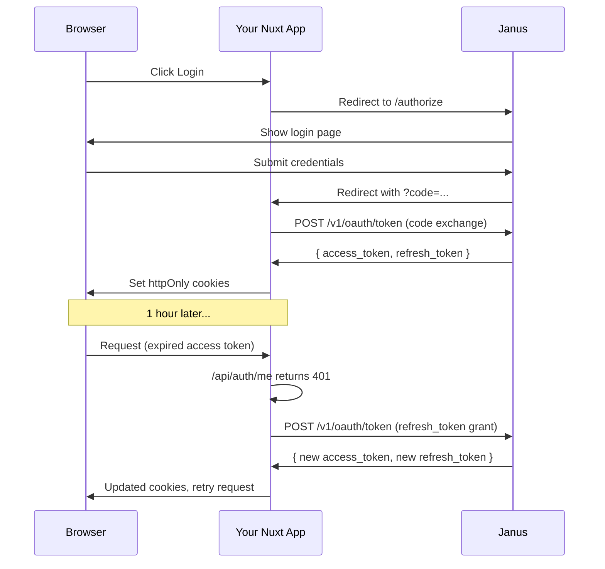

# Janus OAuth Client Integration

This guide covers everything you need to integrate a Nuxt application with Janus
as an SSO provider. It uses the OAuth 2.0 authorization code flow with refresh
token rotation, giving users a seamless login experience that stays alive for up
to 14 days without requiring them to re-authenticate.

## How it works

The authentication flow has four stages. First, the user clicks "Login" and gets
redirected to the Janus login page. After authenticating (via Google OAuth or
username/password), Janus redirects back to your app with a short-lived
authorization code. Your server exchanges that code for two tokens: an access
token (a JWT valid for 1 hour) and a refresh token (an opaque string valid for
14 days). Both are stored in httpOnly cookies so they're invisible to
client-side JavaScript.

When the access token expires, your app silently exchanges the refresh token for
a fresh pair of tokens. The old refresh token is invalidated on every use
(rotation), so if an attacker somehow obtains a used token, the server rejects
it and revokes all tokens for that user as a safety measure.



## Prerequisites

Before you start, you need three things from Janus.

Register your application in the Janus admin panel. This gives you an
`appIdentifier` string that appears in the JWT `aud` claim.

Create a client for your application. This gives you a `client_id` and
`client_secret`. Register your callback URL (e.g.
`https://your-app.com/auth/callback`) as an allowed redirect URI.

Note your Janus instance URLs. You need the API URL (e.g.
`https://auth-api.charleybyrne.com`) for server-to-server token exchanges, and
the UI URL (e.g. `https://auth.charleybyrne.com`) for browser redirects.

## Runtime configuration

Add these keys to your `nuxt.config.ts`. The `janus` block is server-only
(contains the client secret), while `public` values are available on the client.

```ts
// nuxt.config.ts
export default defineNuxtConfig({
  runtimeConfig: {
    janus: {
      url: "",
      clientId: "",
      clientSecret: "",
      appIdentifier: "",
    },
    public: {
      janusUiUrl: "",
      janusClientId: "",
      appUrl: "",
    },
  },
});
```

Set these via environment variables in your deployment:

```
NUXT_JANUS_URL=https://auth-api.charleybyrne.com
NUXT_JANUS_CLIENT_ID=your_client_id
NUXT_JANUS_CLIENT_SECRET=your_client_secret
NUXT_JANUS_APP_IDENTIFIER=your.app.identifier
NUXT_PUBLIC_JANUS_UI_URL=https://auth.charleybyrne.com
NUXT_PUBLIC_JANUS_CLIENT_ID=your_client_id
NUXT_PUBLIC_APP_URL=https://your-app.com
```

## Dependencies

You need `jose` for JWT verification on the server side:

```bash
npm install jose
```

## File structure

The integration requires seven files. Complete, ready-to-copy versions of each
file are available in this directory alongside this document.

```
server/
  app/
    auth.ts              # JWT verification, constants, user extraction
  api/auth/
    callback.post.ts     # Code exchange, sets cookies
    refresh.post.ts      # Silent token refresh
    me.get.ts            # Returns user profile from JWT
    logout.post.ts       # Clears cookies
app/
  composables/
    useAuth.ts           # Reactive auth state, auto-refresh
  middleware/
    auth.global.ts       # Route protection
  plugins/
    auth.ts              # Hydrates user on startup
```

## Server-side auth utilities

The `server/app/auth.ts` file is the foundation. It verifies JWTs using Janus's
JWKS endpoint, maps the JWT claims to a typed user object, and exports two
cookie lifetime constants that the API routes share.

The `ACCESS_TOKEN_MAX_AGE` constant (3600 seconds / 1 hour) controls how long
the browser keeps the access token cookie. The `REFRESH_TOKEN_MAX_AGE` constant
(1,209,600 seconds / 14 days) controls the refresh token cookie lifetime. These
match the server-side expiry times set by Janus, so the cookies and the tokens
themselves expire in lockstep.

See `server/auth.ts` in this directory for the complete implementation.

## API routes

**callback.post.ts**

The callback route receives the authorization code from the browser, sends it to
Janus in exchange for tokens, and stores both tokens as httpOnly cookies. The
access token cookie expires after 1 hour. The refresh token cookie expires after
14 days.

**refresh.post.ts**

The refresh route reads the refresh token from its cookie, sends it to Janus
with `grant_type=refresh_token`, and replaces both cookies with the fresh
values. If the refresh fails (expired, revoked, or invalid token), it clears
both cookies and returns a 401.

**me.get.ts**

Returns the authenticated user's profile by verifying the access token JWT. This
is what the client-side `useAuth` composable calls to hydrate user state.

**logout.post.ts**

Deletes both cookie and returns a success response. The client-side composable
clears local state and redirects to the login page.

## Client-side composable

The `useAuth` composable provides a reactive `user` object and a `loggedIn`
computed property. The `fetchUser` function calls `/api/auth/me` and, if that
fails (expired access token), automatically attempts a silent refresh via
`/api/auth/refresh` before retrying. This means the user never sees a login page
as long as their refresh token is still valid.

The `login` function builds the Janus authorization URL and redirects the
browser. The `logout` function hits the logout endpoint and clears local state.

## Auth middleware

The global route middleware runs on every navigation. It skips public paths
(`/auth/login`, `/auth/callback`, `/auth/logout`) and checks whether the user is
logged in. If not, it calls `fetchUser` which includes the silent refresh
attempt. Only if that also fails does it redirect to the login page.

## Auth plugin

The plugin runs once at app startup. On the server it awaits `fetchUser` so that
SSR has access to the user state. On the client it fires `fetchUser` in the
background so it doesn't block hydration.

## Callback page

You need a page at `app/pages/auth/callback.vue` to handle the redirect from
Janus:

```vue
<script setup lang="ts">
const route = useRoute();
const config = useRuntimeConfig();
const { fetchUser } = useAuth();
const error = ref<string | null>(null);

onMounted(async () => {
  const code = route.query.code as string;
  if (!code) {
    error.value = "No authorization code received";
    return;
  }

  try {
    await $fetch("/api/auth/callback", {
      method: "POST",
      body: {
        code,
        redirectUri: `${config.public.appUrl}/auth/callback`,
      },
    });
    await fetchUser();
    navigateTo("/home");
  } catch {
    error.value = "Authentication failed. Please try again.";
  }
});
</script>

<template>
  <div class="flex min-h-screen items-center justify-center">
    <p v-if="error" class="text-red-500">{{ error }}</p>
    <p v-else>Signing you in...</p>
  </div>
</template>
```

## Security considerations

All tokens are stored in httpOnly cookies, which means client-side JavaScript
cannot read them. This protects against XSS-based token theft. The `secure` flag
is set in production so cookies are only sent over HTTPS. The `sameSite: lax`
setting prevents the cookies from being sent in cross-origin requests,
mitigating CSRF.

Refresh tokens are rotated on every use. When Janus sees a previously used
refresh token, it assumes a potential replay attack and revokes all refresh
tokens for that user, forcing a fresh login. This limits the damage window if a
token is somehow leaked.

The client secret never leaves the server. It's only used in server-to-server
calls to Janus and is never exposed to the browser.
