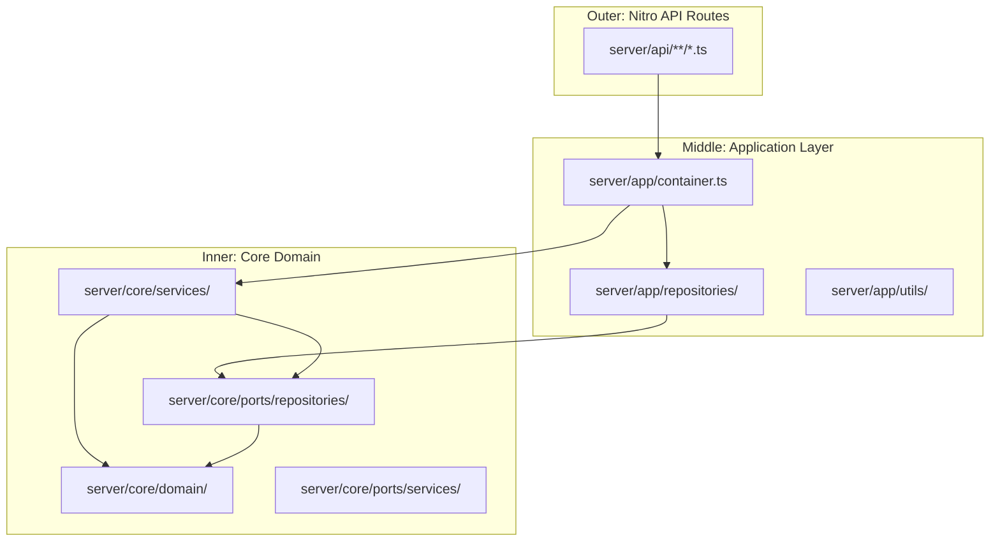
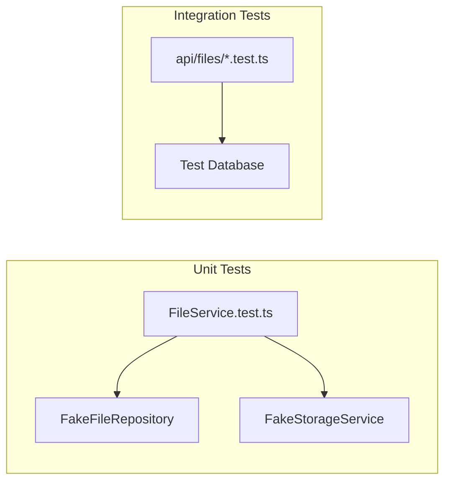

# Hexagonal Architecture

All backend code in Storage follows a hexagonal (ports and adapters)
architecture. This pattern is already established in the sibling `boards`
project under `/home/kmjbyrne/Development/projects/charleybyrne/boards/` and is
carried forward here with the same conventions. The goal is to keep domain logic
free of framework dependencies so it can be tested with in-memory fakes and
reasoned about independently.

## Layer Overview

The backend is divided into three concentric layers. Dependencies always point
inward -- outer layers know about inner layers, but inner layers never import
from outer layers.



**Core Domain** (`server/core/`)

This is the innermost layer. It contains plain TypeScript types and interfaces
with zero framework imports. Domain types define the shape of business entities
(files, folders, spaces, tags). Port interfaces define contracts that the outer
layers must fulfil. Services contain business logic that orchestrates domain
operations through ports.

**Application Layer** (`server/app/`)

This layer contains concrete implementations of the port interfaces. In
practice, this means Drizzle ORM repository classes that implement the
repository port interfaces, a dependency injection container that wires
everything together, and utility modules for cross-cutting concerns like
authentication and file storage.

**API Layer** (`server/api/`)

Nitro event handlers that receive HTTP requests, validate input, call domain
services through the container, and return responses. These handlers are
intentionally thin -- they do not contain business logic.

## Directory Structure

```
server/
  core/
    domain/
      workspace.ts
      space.ts
      folder.ts
      file.ts
      file-version.ts
      member.ts
      user.ts
      tag.ts
      file-tag.ts
      comment.ts
      file-share.ts
    ports/
      repositories/
        workspace.repository.port.ts
        space.repository.port.ts
        folder.repository.port.ts
        file.repository.port.ts
        file-version.repository.port.ts
        member.repository.port.ts
        tag.repository.port.ts
        comment.repository.port.ts
        file-share.repository.port.ts
      services/
        storage.service.port.ts
        auth.service.port.ts
    services/
      file.service.ts
      folder.service.ts
      space.service.ts
      tag.service.ts
      share.service.ts
      version.service.ts
      workspace.service.ts
  app/
    container.ts
    repositories/
      workspace.repository.ts
      space.repository.ts
      folder.repository.ts
      file.repository.ts
      file-version.repository.ts
      member.repository.ts
      tag.repository.ts
      comment.repository.ts
      file-share.repository.ts
    utils/
      auth.ts
      storage.ts
  api/
    workspaces/
      index.get.ts
    spaces/
      index.get.ts
      index.post.ts
      [id]/
        index.get.ts
        index.patch.ts
        index.delete.ts
    folders/
      index.post.ts
      [id]/
        index.get.ts
        index.patch.ts
        index.delete.ts
        children.get.ts
    files/
      index.post.ts
      [id]/
        index.get.ts
        index.patch.ts
        index.delete.ts
        download.get.ts
        star.post.ts
        star.delete.ts
        versions.get.ts
        versions/
          [versionId]/
            restore.post.ts
        share.post.ts
        share/
          [shareId].delete.ts
        comments.get.ts
        comments.post.ts
    tags/
      index.get.ts
      index.post.ts
      [id]/
        index.patch.ts
        index.delete.ts
    trash/
      index.get.ts
      [id]/
        restore.post.ts
        index.delete.ts
```

## Pattern: Domain Types

Domain types are plain interfaces with no decorators, no ORM annotations, and no
framework imports. They represent the shape of data as the business logic
understands it.

This pattern is taken directly from the boards project. For example, the boards
project defines `Zone` as a plain interface in `server/core/domain/zone.ts`:

```typescript
// server/core/domain/zone.ts (boards project, for reference)
export interface Zone {
  id: string;
  name: string;
  description?: string | null;
  created_by: string;
  created_at: Date;
  updated_at: Date;
}
```

Storage follows the same convention. All domain types are defined in
[data-model.md](./data-model.md).

## Pattern: Port Interfaces

Port interfaces define the contract between domain services and the outside
world. Repository ports specify what data access operations are available
without saying how they are implemented.

```typescript
// server/core/ports/repositories/file.repository.port.ts
import type { File, FileType } from "../../domain/file";

export interface CreateFileData {
  folder_id: string;
  name: string;
  ext: string;
  type: FileType;
  size_bytes: number;
  mime_type: string;
  storage_key: string;
  owner_id: string;
}

export interface IFileRepository {
  findById(id: string): Promise<File | null>;
  findByFolder(folderId: string): Promise<File[]>;
  findStarred(workspaceId: string): Promise<File[]>;
  findRecent(workspaceId: string, limit?: number): Promise<File[]>;
  search(workspaceId: string, query: string): Promise<File[]>;
  create(data: CreateFileData): Promise<File>;
  update(id: string, data: Partial<CreateFileData>): Promise<File | null>;
  softDelete(id: string): Promise<void>;
  restore(id: string): Promise<void>;
  permanentDelete(id: string): Promise<void>;
  listTrashed(workspaceId: string): Promise<File[]>;
  setStar(id: string, starred: boolean): Promise<void>;
}
```

Service ports abstract infrastructure concerns like file storage or
authentication:

```typescript
// server/core/ports/services/storage.service.port.ts
export interface IStorageService {
  upload(key: string, data: Buffer, mimeType: string): Promise<string>;
  download(key: string): Promise<Buffer>;
  delete(key: string): Promise<void>;
  getSignedUrl(key: string, expiresIn?: number): Promise<string>;
}
```

## Pattern: Domain Services

Domain services contain business logic. They depend only on port interfaces
(injected through the constructor) and domain types. They never import from
Nitro, Drizzle, or any other framework.

```typescript
// server/core/services/file.service.ts
import type { IFileRepository } from "../ports/repositories/file.repository.port";
import type { IStorageService } from "../ports/services/storage.service.port";
import type { IFileVersionRepository } from "../ports/repositories/file-version.repository.port";
import type { File } from "../domain/file";

export class FileService {
  constructor(
    private readonly files: IFileRepository,
    private readonly storage: IStorageService,
    private readonly versions: IFileVersionRepository,
  ) {}

  async getFile(fileId: string): Promise<File> {
    const file = await this.files.findById(fileId);
    if (!file) {
      throw createError({ statusCode: 404, message: "File not found" });
    }
    return file;
  }

  async listFolder(folderId: string): Promise<File[]> {
    return this.files.findByFolder(folderId);
  }

  async toggleStar(fileId: string): Promise<File> {
    const file = await this.getFile(fileId);
    await this.files.setStar(fileId, !file.starred);
    return { ...file, starred: !file.starred };
  }

  // Additional methods for upload, delete, restore, etc.
}
```

This mirrors the boards project's `ZoneService`, which takes repository ports
through its constructor and contains all zone-related business logic.

## Pattern: Adapter Implementations

Adapters are concrete classes that implement port interfaces using real
infrastructure. Repository adapters use Drizzle ORM. Storage adapters use the
local filesystem or S3.

```typescript
// server/app/repositories/file.repository.ts
import { eq } from "drizzle-orm";
import type { db as Database } from "hub:db";
import { schema } from "hub:db";
import type {
  IFileRepository,
  CreateFileData,
} from "../../core/ports/repositories/file.repository.port";
import type { File } from "../../core/domain/file";

export class DrizzleFileRepository implements IFileRepository {
  constructor(private readonly db: typeof Database) {}

  async findById(id: string): Promise<File | null> {
    const row = await this.db.query.files.findFirst({
      where: (f, { eq: e }) => e(f.id, id),
    });
    return row ?? null;
  }

  // ... remaining methods
}
```

## Pattern: Container (Dependency Injection)

A single container module wires all services and repositories together. API
handlers import the container and call service methods on it.

```typescript
// server/app/container.ts
import { DrizzleFileRepository } from "./repositories/file.repository";
import { DrizzleFolderRepository } from "./repositories/folder.repository";
import { FileService } from "../core/services/file.service";
import { FolderService } from "../core/services/folder.service";
// ... additional imports

export const container = {
  fileService: new FileService(
    new DrizzleFileRepository(db),
    new LocalStorageService(),
    new DrizzleFileVersionRepository(db),
  ),
  folderService: new FolderService(new DrizzleFolderRepository(db)),
  // ... additional services
};
```

## Pattern: Thin API Handlers

API route handlers validate input, extract auth context, call a service method,
and return the result. They contain no business logic.

```typescript
// server/api/files/[id]/index.get.ts
import { container } from "~~/server/app/container";
import { requireAuth } from "~~/server/app/utils/auth";

export default defineEventHandler(async (event) => {
  await requireAuth(event);
  const id = getRouterParam(event, "id");
  if (!id) {
    throw createError({ statusCode: 400, message: "Missing file ID" });
  }
  return container.fileService.getFile(id);
});
```

This is identical to how the boards project structures its handlers. The
`POST /api/zones` handler in boards imports `container`, calls
`container.zoneService.createZone()`, and returns the result.

## Testing Strategy

The hexagonal architecture makes testing straightforward. Domain services can be
tested with in-memory fake implementations of the repository ports. No database,
no HTTP server, no filesystem access needed.



Unit tests instantiate a service with fake repositories, call service methods,
and assert on the results. Integration tests spin up the Nitro server with a
test database and make real HTTP requests.

The nitro-vitest-tester agent is the right tool for writing these tests, as it
understands the Vitest patterns and Nitro-specific globals used in this project
family.

## Storage Backend

For the initial implementation, uploaded files are stored on the local
filesystem. The `IStorageService` port abstracts this so the backend can be
swapped to S3, R2, or any other object store later without changing any domain
code.

The local storage adapter writes files to a configurable directory (defaulting
to `./data/uploads/`) and generates storage keys based on the file ID and a
timestamp to avoid collisions. Signed URLs for download are not needed for local
storage, so `getSignedUrl` can return a direct path that the download API
handler serves.

## Database

The application uses Drizzle ORM with a SQLite database for the initial
deployment. Drizzle was chosen for consistency with the boards project and
because it works well with Nuxt's server engine (Nitro). The database schema is
defined in Drizzle's schema format and lives alongside the adapter
implementations.

Migration management uses Drizzle Kit. The schema maps directly to the domain
types but may include additional database-specific fields like auto-incrementing
IDs or indexed columns that are not exposed in the domain interfaces.

## Relationship to Other Documents

The domain types referenced throughout this document are fully defined in
[data-model.md](./data-model.md). The API routes serve the sidebar navigation
described in [sidebar-navigation.md](./sidebar-navigation.md) and the file
browser described in [file-browser.md](./file-browser.md). The document viewer
described in [document-viewer.md](./document-viewer.md) will eventually add new
services and ports to this architecture.
