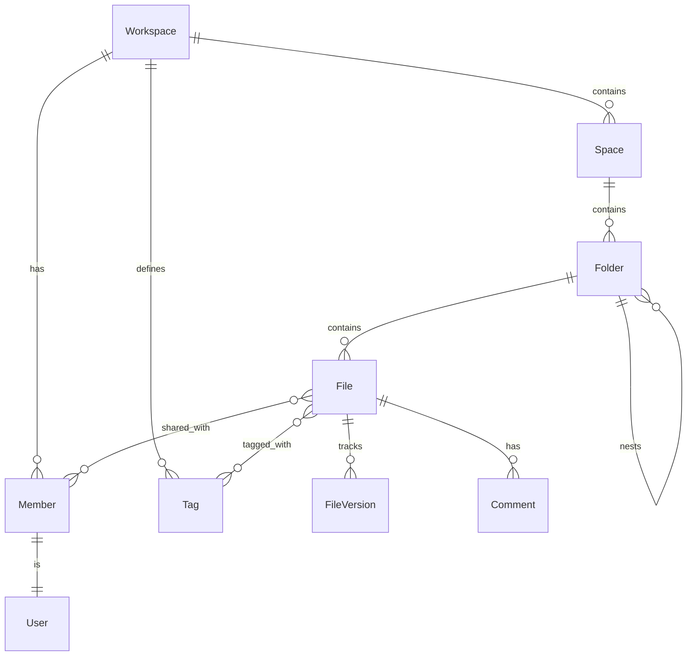

# Data Model

This document defines the core domain entities, their relationships, and the
mock data structures used during frontend development. These types live in the
`server/core/domain/` directory and have no framework dependencies, following
the hexagonal architecture pattern described in
[architecture.md](./architecture.md).

## Entity Overview

The data model is organised around a hierarchical file tree with cross-cutting
concepts for collaboration and organisation.



## Workspace

A workspace is the top-level tenant boundary. Everything in the application
belongs to exactly one workspace. In a single-user deployment there is one
workspace, but the model supports multiple workspaces for future multi-tenancy.

```typescript
// server/core/domain/workspace.ts
export interface Workspace {
  id: string;
  name: string;
  storage_limit_bytes: number;
  storage_used_bytes: number;
  created_at: Date;
  updated_at: Date;
}
```

The `storage_limit_bytes` and `storage_used_bytes` fields power the storage
gauge in the sidebar footer. The ratio between them determines the percentage
displayed and the colour of the progress bar.

## Space

Spaces are the primary organisational containers within a workspace. They sit
above folders in the hierarchy and carry visual metadata -- a colour and an icon
-- that distinguishes them in the sidebar tree.

```typescript
// server/core/domain/space.ts
export type SpaceColor =
  | "blue"
  | "green"
  | "purple"
  | "orange"
  | "red"
  | "pink"
  | "yellow"
  | "gray";

export interface Space {
  id: string;
  workspace_id: string;
  name: string;
  color: SpaceColor;
  icon: string;
  sort_order: number;
  created_at: Date;
  updated_at: Date;
}
```

The `icon` field stores an icon identifier compatible with the Iconify icon set
used by Nuxt UI (the project already depends on `@iconify-json/lucide`). The
`sort_order` field controls the display order in the sidebar tree.

The default spaces created for a new workspace are:

| Name         | Color  | Icon           |
| ------------ | ------ | -------------- |
| Personal     | blue   | lucide:user    |
| Family       | green  | lucide:users   |
| Design       | purple | lucide:palette |
| Code Archive | gray   | lucide:code    |

## Folder

Folders provide nested hierarchy within a space. They are self-referential,
allowing arbitrary nesting depth through the `parent_id` field.

```typescript
// server/core/domain/folder.ts
export interface Folder {
  id: string;
  space_id: string;
  parent_id: string | null;
  name: string;
  sort_order: number;
  created_at: Date;
  updated_at: Date;
}
```

A folder with `parent_id: null` is a root-level folder within its space. The
sidebar tree component renders folders recursively using this parent
relationship.

## File

Files are the leaf nodes of the hierarchy. Each file belongs to exactly one
folder and carries rich metadata for display, filtering, and organisation.

```typescript
// server/core/domain/file.ts
export type FileType =
  | "doc"
  | "pdf"
  | "image"
  | "video"
  | "design"
  | "code"
  | "zip";

export interface File {
  id: string;
  folder_id: string;
  name: string;
  ext: string;
  type: FileType;
  size_bytes: number;
  mime_type: string;
  storage_key: string;
  owner_id: string;
  starred: boolean;
  created_at: Date;
  updated_at: Date;
}
```

The `storage_key` field references the file's location in the underlying storage
backend (local filesystem, S3, or similar). The `type` field is derived from
`ext` at upload time using the centralised extension-to-type mapping defined in
the file type system (see [file-browser.md](./file-browser.md)).

The `starred` field is per-user in practice, but for the initial single-user
implementation it lives directly on the file record. When multi-user support is
added, starring will move to a join table between files and users.

## File Version

Every time a file is updated, the previous state is preserved as a version
record. This powers the version history modal in the file browser.

```typescript
// server/core/domain/file-version.ts
export interface FileVersion {
  id: string;
  file_id: string;
  version_number: number;
  size_bytes: number;
  storage_key: string;
  created_by: string;
  created_at: Date;
}
```

Version numbers increment monotonically. Restoring a previous version creates a
new version entry rather than modifying history, ensuring the version timeline
is append-only and fully reversible.

## Member

Members represent users within a workspace context. The member record links a
user to a workspace and carries workspace-level metadata like their role and
avatar.

```typescript
// server/core/domain/member.ts
export type WorkspaceRole = "owner" | "admin" | "editor" | "viewer";

export interface Member {
  id: string;
  workspace_id: string;
  user_id: string;
  role: WorkspaceRole;
  display_name: string;
  email: string;
  avatar_url: string | null;
  joined_at: Date;
}
```

Members appear throughout the UI as avatar stacks on shared files, in the share
dialog's access list, and as the "owner" display on file metadata rows.

## User

The user entity represents a person who can authenticate and belong to one or
more workspaces. It is intentionally minimal since most user-facing information
is carried by the member record.

```typescript
// server/core/domain/user.ts
export interface User {
  id: string;
  email: string;
  first_name: string;
  last_name: string;
  avatar_url: string | null;
  created_at: Date;
  updated_at: Date;
}
```

## Tag

Tags provide a flat, cross-cutting labelling system. Files can have multiple
tags, and tags can span across spaces and folders. Clicking a tag in the sidebar
filters the file browser to show all files with that tag regardless of location.

```typescript
// server/core/domain/tag.ts
export type TagColor =
  | "red"
  | "orange"
  | "yellow"
  | "green"
  | "blue"
  | "purple"
  | "pink"
  | "gray";

export interface Tag {
  id: string;
  workspace_id: string;
  name: string;
  color: TagColor;
  created_at: Date;
}
```

The default tags for a new workspace are:

| Name        | Color  |
| ----------- | ------ |
| Tax         | red    |
| Inspiration | purple |
| Read later  | blue   |
| Important   | orange |

The many-to-many relationship between files and tags is modelled through a join
table.

```typescript
// server/core/domain/file-tag.ts
export interface FileTag {
  file_id: string;
  tag_id: string;
  created_at: Date;
}
```

## Comment

Comments are threaded discussions attached to a file. They appear in the
Comments tab of the preview pane.

```typescript
// server/core/domain/comment.ts
export interface Comment {
  id: string;
  file_id: string;
  author_id: string;
  parent_id: string | null;
  body: string;
  created_at: Date;
  updated_at: Date;
}
```

The `parent_id` field enables nested replies. A comment with `parent_id: null`
is a top-level comment; one with a parent is a reply.

## File Share

When a file is shared with specific members, the permission level is tracked
through a share record.

```typescript
// server/core/domain/file-share.ts
export type ShareRole = "viewer" | "commenter" | "editor";

export interface FileShare {
  id: string;
  file_id: string;
  member_id: string;
  role: ShareRole;
  shared_by: string;
  created_at: Date;
}
```

General access (the "Anyone with the link" toggle in the share dialog) is
modelled as a field on the file itself rather than through share records. This
keeps the share table focused on explicit per-person grants.

## Mock Data

During frontend development, mock data provides realistic content for the UI
before the backend API is operational. The mock data should be defined in a
`app/mocks/` directory as plain TypeScript files that export arrays of each
entity type.

The mock dataset should include at least one workspace with four spaces
(Personal, Family, Design, Code Archive), several nested folders per space, a
mix of file types across folders, two or three members with distinct avatars,
all four default tags applied to various files, and a few files with version
history entries.

A separate document will not be created for mock data specifics. Instead, the
mock files should be self-documenting and follow the type definitions above
exactly. This ensures that when the real backend is connected, the mock data can
be deleted without any type mismatches.

## Relationship to Architecture

These domain types form the innermost layer of the hexagonal architecture. They
have no imports from Nuxt, Nitro, Drizzle, or any other framework. Port
interfaces in `server/core/ports/` define repository contracts using these
types, and adapter implementations in `server/app/repositories/` provide the
concrete database access. See [architecture.md](./architecture.md) for the full
layer breakdown.
