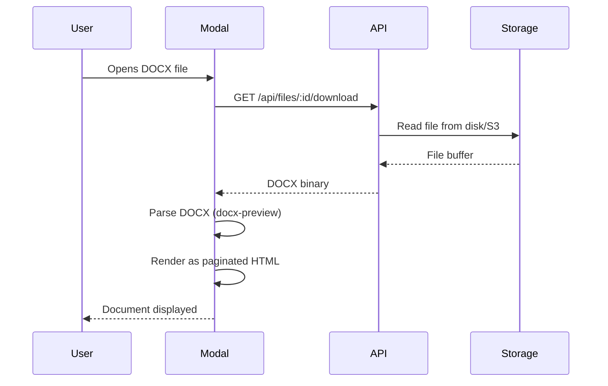

# Document Viewer (Future)

This document describes the planned DOCX web viewer and editor feature. It is
intentionally not being implemented yet but is documented here to capture the
design intent, technical approach, and constraints so that work can begin when
the time is right.

## Motivation

A file storage application that can only upload and download documents is
missing a major opportunity. Users expect to be able to preview and lightly edit
common document formats without leaving the browser, the same way Google Drive
renders PDFs and Docs inline. The most impactful format to support first is
DOCX, since it is the dominant document format in professional and personal use.

The goal is not to build a full word processor. It is to provide a faithful
read-only rendering of DOCX files with basic editing capabilities for common
operations like fixing typos, updating text, and adjusting simple formatting.

## Design Vision

The viewer is presented as a full-screen modal that mimics the look and feel of
a lightweight web-based word processor. The design takes cues from Word for the
Web and Google Docs, with a simplified interface that feels native to the
Storage application rather than being an embedded third-party widget.

**Ribbon / Toolbar**

A horizontal toolbar at the top of the modal provides formatting controls. For
the read-only mode, this toolbar shows view-related controls like zoom, page
navigation, and a search-within-document feature. When editing is enabled, the
toolbar expands to include text formatting (bold, italic, underline), paragraph
alignment, heading levels, and list controls.

**Document Body**

The central area renders the DOCX content as paginated HTML. Each page is a
distinct visual block with margins, headers, and footers matching the document's
layout. The rendering should handle common DOCX elements: paragraphs, headings,
tables, images, lists (ordered and unordered), bold, italic, underline, font
sizes, and colours.

**Status Bar**

A footer bar shows the current page number, total page count, word count, and
zoom level. This provides the same ambient information that desktop word
processors display.

## Technical Approach

### DOCX Parsing

DOCX files are ZIP archives containing XML documents that follow the Office Open
XML (OOXML) specification. The most promising open-source libraries for parsing
and rendering DOCX in the browser are:

`docx-preview` is a client-side library that renders DOCX files as HTML directly
in the browser. It handles most common formatting elements and produces
reasonably faithful output. It works by parsing the OOXML XML and generating
styled HTML elements.

`mammoth.js` takes a different approach, converting DOCX to simplified HTML
using semantic mappings. It produces cleaner HTML but loses some visual
fidelity. It is better suited for extracting content than for faithful
rendering.

The recommended approach is to use `docx-preview` for the viewer mode since
visual fidelity matters more there, and to evaluate whether `mammoth.js` is
useful for the editing mode where a simpler DOM structure is easier to
manipulate.

### Rendering Pipeline

The file is downloaded as a binary blob through the existing file download API.
Parsing and rendering happen entirely on the client side, which avoids adding
server-side document processing dependencies and keeps the architecture simple.

### Editing (Phase 2)

Editing is significantly more complex than viewing and should be treated as a
separate phase. The approach would be to use `contenteditable` regions within
the rendered HTML and track changes as a diff against the original document.
When the user saves, the diffs are applied to the original DOCX XML and the
modified file is uploaded as a new version.

This is not trivial. OOXML is a complex format, and round-tripping edits from
HTML back to DOCX without losing formatting is a hard problem. A more pragmatic
approach might be to limit editing to plain text changes within existing
paragraphs and defer structural edits (adding tables, changing layouts) to a
later phase or to external tools.

### Test File

A test DOCX file is available at `~/Downloads/keith-byrne-cv-2023.docx`. This
should be used during development to verify that the viewer correctly renders a
real-world document with varied formatting, rather than relying solely on
synthetic test files.

## Architecture Integration

The document viewer introduces one new domain concept: a viewer session.
However, since rendering is entirely client-side, no new server-side services or
ports are needed for the read-only viewer. The existing `FileService.getFile()`
and the download endpoint are sufficient.

When editing is added, a new `DocumentService` may be needed to handle DOCX
manipulation on the server side (for example, if server-side rendering or PDF
export is desired). This service would follow the same hexagonal pattern as all
other services, with a port interface in `server/core/ports/services/` and an
implementation in `server/app/`.

## Other Future Features

Several other features are planned but not yet specified in detail. They are
listed here to maintain a single reference point for the roadmap.

**AI Summaries and File-Level Chat**

The ability to generate AI-powered summaries of document content and to ask
questions about a file in a chat interface. This would require integrating an
LLM API (likely through a new `IAiService` port) and building a chat UI
component in the preview pane. The summary could be cached as file metadata to
avoid repeated API calls.

**Activity Feed**

A chronological stream of actions taken across the workspace: file uploads,
shares, edits, comments, and deletions. This requires an event logging system
that records actions as they happen. The feed would appear as a new special view
in the sidebar, alongside Home and Recents.

**Photo Gallery and Lightbox**

A dedicated view for browsing image files in a grid with a full-screen lightbox
for viewing individual images. This is distinct from the file browser's grid
view in that it would focus exclusively on images, support swipe/arrow
navigation between images, and possibly offer basic image adjustments like
rotation and cropping.

**Mobile Responsive Layout**

The current design assumes a desktop viewport. Mobile support requires
rethinking the sidebar (collapsible drawer), file browser (simplified list or
grid), and preview pane (full-screen overlay only). Nuxt UI v4's responsive
utilities and Tailwind's breakpoint system provide the foundation, but the
component structure may need significant adaptation.

## Relationship to Other Documents

The file download API used by the viewer is part of the API surface described in
[architecture.md](./architecture.md). The file type system that identifies DOCX
files is defined in [file-browser.md](./file-browser.md). The version history
system that tracks edits is part of the data model in
[data-model.md](./data-model.md).
