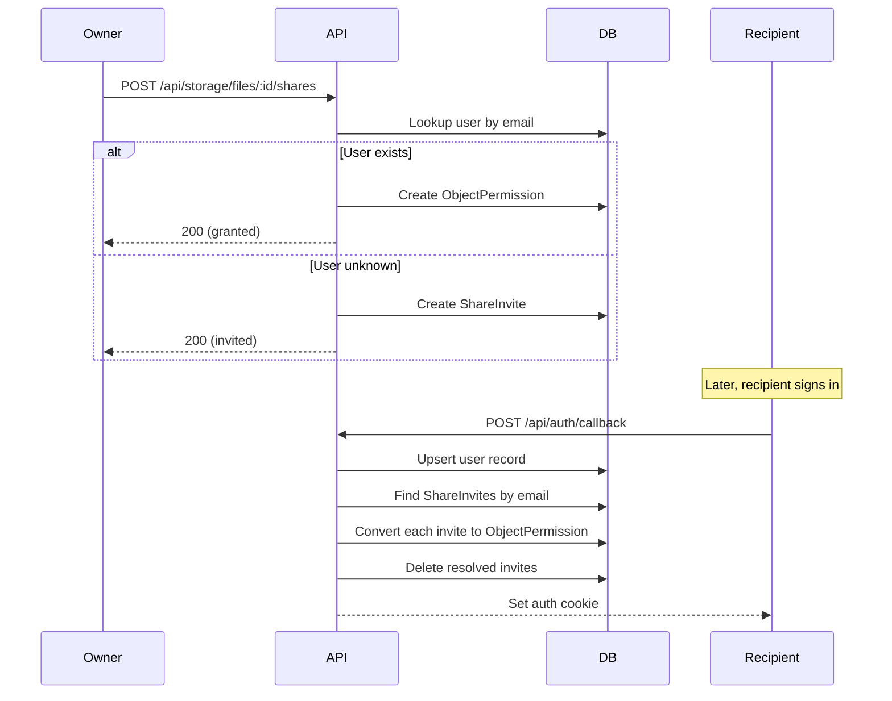

# Sharing and Activity

This document covers two tightly related features: the file sharing system and
the activity feed that tracks events across the application. Sharing is already
implemented; the activity feed builds on top of it to give users visibility into
what is happening across their workspace.

## Sharing

Sharing allows a user to grant access to a file, folder, or space to another
person by email. The system handles two cases: the recipient already has an
account, or they do not yet exist in the system.

### How Sharing Works

When a user shares a resource, the system first checks whether the recipient
email belongs to a known user. If it does, an `ObjectPermission` record is
created immediately, granting that user the chosen role on the resource. If the
email does not match any existing user, a `ShareInvite` record is created
instead, holding the email, role, object reference, and who granted it.



### Invite Resolution

The auth callback handler at `server/api/auth/callback.post.ts` resolves pending
invites automatically. After upserting the user record from the JWT claims, it
queries `ShareInvite` records matching the user's email. Each matching invite is
converted into a real `ObjectPermission` and then deleted. This means the
recipient gains access the moment they first sign in, with no additional accept
step required.

### Domain Types

The sharing system relies on two domain entities defined in
`server/core/domain/`.

**ObjectPermission** (`permission.ts`)

Represents a direct access grant. The `objectType` field distinguishes between
files, folders, and spaces. Permissions on parent objects cascade down through
the hierarchy via the `PermissionService.resolve` method, which walks up from
file to parent folders to the space.

```typescript
// server/core/domain/permission.ts
interface ObjectPermission {
  id: string;
  objectId: string;
  objectType: ObjectType; // 'file' | 'folder' | 'space'
  subjectId: string; // the user who receives access
  role: PermissionRole; // 'viewer' | 'editor' | 'admin'
  grantedBy: string; // the user who shared it
  createdAt: Date;
}
```

**ShareInvite** (`share-invite.ts`)

A temporary record for recipients who are not yet registered. It mirrors the
permission shape but uses an email address instead of a user ID.

```typescript
// server/core/domain/share-invite.ts
interface ShareInvite {
  id: string;
  objectId: string;
  objectType: ObjectType;
  email: string;
  role: PermissionRole;
  grantedBy: string;
  createdAt: Date;
}
```

### Permission Hierarchy

The `PermissionService.resolve` method implements hierarchical permission
lookup. When checking whether a user can access a file, the service first looks
for a direct grant on the file itself. If none exists, it walks up through
parent folders, and finally checks the space. The highest role found along this
path becomes the user's effective permission. This means sharing a space with
someone gives them access to everything inside it without needing individual
file-level grants.

Owners are handled separately from the permission system. The caller checks
`ownerId === subjectId` before falling through to permission resolution, because
owners implicitly have admin access to everything they own.

### API Routes

| Method | Route                                    | Description                             |
| ------ | ---------------------------------------- | --------------------------------------- |
| GET    | `/api/storage/files/:id/shares`          | List collaborators on a file            |
| POST   | `/api/storage/files/:id/shares`          | Share a file with a user by email       |
| DELETE | `/api/storage/files/:id/shares/:subject` | Revoke access for a specific user       |
| GET    | `/api/storage/shared`                    | List files shared with the current user |
| GET    | `/api/storage/shared-by-me`              | List files the current user has shared  |
| GET    | `/api/storage/sharing/collaborators`     | Resolve collaborator details            |
| POST   | `/api/storage/sharing/grant`             | Grant access (alternative endpoint)     |
| POST   | `/api/storage/sharing/revoke`            | Revoke access (alternative endpoint)    |

### Frontend

The sharing UI consists of a `ShareModal` component that displays a form for
adding collaborators by email. It shows the current list of people with access,
including pending invites marked with a "Pending" badge. Each collaborator shows
their avatar (or a mail icon for pending invites), email, and role.

In the file list view, the MEMBERS column renders avatar circles for shared
users. Pending invites show a mail envelope icon instead of the user's initials.
Hovering any avatar displays a tooltip with the email and pending status.

The "Shared by me" sidebar view (`/shared-by-me`) fetches from
`/api/storage/shared-by-me` and renders files the current user has shared with
others.

## Activity Feed (Planned)

The activity feed records significant events in the application and presents
them as a chronological timeline. Each entry describes who did what, to which
object, and optionally who was affected.

### Why Activity Matters

Without an activity feed, sharing is a fire-and-forget action. The person who
shared a file has no record of it beyond checking the share modal again, and the
recipient has no notification that something was shared with them. The activity
feed closes this gap by giving both parties a timeline of events.

### Domain Entity

The `Activity` entity lives at `server/core/domain/activity.ts`. It has no
dependencies on framework code or other domain files beyond reusing the
`ObjectType` type.

```typescript
// server/core/domain/activity.ts
import type { ObjectType } from "./permission";

type ActivityAction =
  | "file.uploaded"
  | "file.renamed"
  | "file.starred"
  | "file.unstarred"
  | "file.trashed"
  | "file.restored"
  | "file.deleted"
  | "folder.created"
  | "folder.deleted"
  | "space.created"
  | "space.deleted"
  | "share.granted"
  | "share.revoked"
  | "share.invited";

interface Activity {
  id: string;
  actorId: string;
  action: ActivityAction;
  objectId: string;
  objectType: ObjectType;
  objectName: string; // snapshot at event time
  targetUserId: string | null; // populated for share.* actions
  createdAt: Date;
}
```

The `objectName` field is deliberately denormalised. If a file is later renamed
or deleted, historical activity entries still describe what they refer to
without joining back to a potentially absent catalog row. This is a conscious
trade-off: the name snapshot is taken at emission time and never updated.

The `targetUserId` field is only populated for share-related actions. For
`share.granted` and `share.revoked`, it holds the subject user's ID. For
`share.invited`, it is null because the invitee is not yet a known user. The
frontend uses this to render personalised messages like "Keith shared README.md
with you".

### Repository Port

```typescript
// server/core/ports/repositories/activity.repository.port.ts
interface IActivityRepository {
  record(activity: Activity): Promise<void>;
  listForActor(
    actorId: string,
    limit: number,
    before?: Date,
  ): Promise<Activity[]>;
  listForViewer(
    viewerId: string,
    limit: number,
    before?: Date,
  ): Promise<Activity[]>;
}
```

`listForActor` returns only the events a specific user has generated.
`listForViewer` returns events visible to a user, meaning events they generated
themselves plus events where they are the `targetUserId`. Both methods support
cursor-based pagination via the `before` timestamp parameter.

### Application Service

```typescript
// server/core/services/activity.service.ts
class ActivityService {
  constructor(private readonly activities: IActivityRepository) {}

  async record(params: {
    actorId: string;
    action: ActivityAction;
    objectId: string;
    objectType: ObjectType;
    objectName: string;
    targetUserId?: string;
  }): Promise<void>;
}
```

The service constructs the full `Activity` entity, generating the UUID and
timestamp, then delegates to the repository. As the system matures, this service
becomes the natural place for deduplication logic (suppressing repeated
star/unstar events within a short window) and notification dispatch.

### Emission Points

Activity should only be emitted from application services, never from route
handlers or repository adapters. This keeps the event logic centralised and
testable.

**StorageService** emits after these operations:

| Operation     | Action           | Notes                          |
| ------------- | ---------------- | ------------------------------ |
| Upload file   | `file.uploaded`  | After blob and catalog created |
| Delete file   | `file.deleted`   | After blob and catalog removed |
| Rename file   | `file.renamed`   | Uses old name as objectName    |
| Star file     | `file.starred`   |                                |
| Unstar file   | `file.unstarred` |                                |
| Trash file    | `file.trashed`   |                                |
| Restore file  | `file.restored`  |                                |
| Create folder | `folder.created` |                                |

**PermissionService** emits after these operations:

| Operation | Action          | targetUserId            |
| --------- | --------------- | ----------------------- |
| Grant     | `share.granted` | The subject (recipient) |
| Revoke    | `share.revoked` | The subject (revoked)   |

Share invite creation emits `share.invited` with `targetUserId` set to null
since the invitee is not yet a known user. When the invite is later resolved
during auth callback, a `share.granted` event is emitted with the now-known user
ID.

### Database Schema

```typescript
// server/database/schema.ts (addition)
export const activities = sqliteTable("activities", {
  id: text("id").primaryKey(),
  actorId: text("actor_id").notNull(),
  action: text("action").notNull(),
  objectId: text("object_id").notNull(),
  objectType: text("object_type").notNull(),
  objectName: text("object_name").notNull(),
  targetUserId: text("target_user_id"),
  createdAt: integer("created_at", { mode: "timestamp" })
    .notNull()
    .$defaultFn(() => new Date()),
});
```

No foreign key constraints are applied. Activity is an audit log that must
survive the deletion of the objects it references. Indexes on
`(actor_id, created_at)` and `(target_user_id, created_at)` support the two
primary query patterns.

### API Routes

| Method | Route                | Description                         |
| ------ | -------------------- | ----------------------------------- |
| GET    | `/api/activity`      | Feed visible to the current user    |
| GET    | `/api/activity/mine` | Only the current user's own actions |

Both endpoints accept `limit` (default 50, max 100) and `before` (ISO timestamp)
query parameters for cursor-based pagination. The response enriches each
activity entry with actor and target display names by joining against the users
table.

```typescript
// Response shape
interface ActivityFeedItem {
  id: string;
  action: ActivityAction;
  objectId: string;
  objectType: ObjectType;
  objectName: string;
  actor: {
    id: string;
    firstName: string;
    lastName: string;
    avatar: string | null;
  };
  target: {
    id: string;
    firstName: string;
    lastName: string;
    avatar: string | null;
  } | null;
  createdAt: string;
}
```

### Frontend Rendering

Each activity entry renders as a single line in the feed. The format varies by
action type but follows a consistent pattern:
`{actor} {verb} {object} [with {target}] {relative time}`.

Examples of how different actions render:

- "Keith uploaded README.md — 2 minutes ago"
- "Keith shared README.md with Natalia — 5 minutes ago"
- "Keith created space My Files — 1 hour ago"
- "Natalia starred budget.xlsx — yesterday"

When the current user is the target, the message substitutes "you": "Keith
shared README.md with you — 5 minutes ago".

### New Files Summary

```
server/core/domain/activity.ts
server/core/ports/repositories/activity.repository.port.ts
server/core/services/activity.service.ts
server/app/repositories/sqlite-activity.repository.ts
server/api/activity/index.get.ts
server/api/activity/mine.get.ts
```

The schema addition goes into the existing `server/database/schema.ts`. The
container wiring goes into `server/app/container.ts`, where `ActivityService` is
injected into `StorageService` and `PermissionService` as an additional
constructor dependency.
